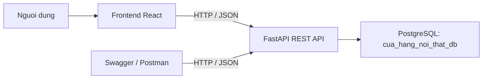
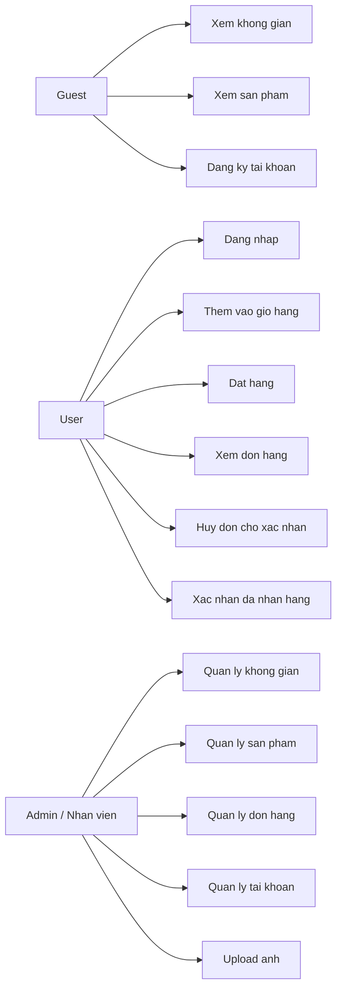
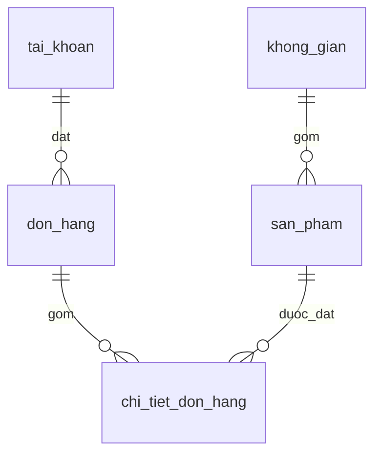
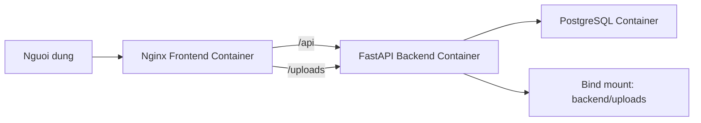

# System Design

## 1. Kien truc tong the

## 2. Use case tong quat

## 3. Internal components

- Frontend:
  - pages
  - components
  - contexts
  - API client
  - form validation
  - router guard
- Backend:
  - route layer
  - schema layer
  - model layer
  - service layer
  - security layer
  - database session

## 4. External components

- Trinh duyet web
- PostgreSQL server
- Swagger UI
- Postman
- Docker / Nginx / Uvicorn khi release Linux

## 5. To chuc project

### 5.1 Backend

- `app/api`: dinh nghia router va endpoint RESTful
- `app/models.py`: mo ta bang va rang buoc database
- `app/schemas`: hop dong request / response
- `app/services`: seed va logic phu tro
- `app/core`: config, JWT, password hashing
- `docs`: schema SQL, dictionary, endpoint list

### 5.2 Frontend

- `src/pages`: giao dien theo tung man hinh
- `src/components`: UI tai su dung
- `src/contexts`: quan ly auth va cart
- `src/lib`: API client, helper catalog, admin helpers
- `src/types`: domain types cho frontend

## 6. ERD tom tat

## 7. Cac bang chinh

- `tai_khoan`
- `khong_gian`
- `san_pham`
- `don_hang`
- `chi_tiet_don_hang`

## 8. Thiet ke giao dien

- Khu user gom cac man hinh: trang chu, danh sach san pham, chi tiet san pham, gio hang, thanh toan, lich su don.
- Khu admin dung layout rieng de quan ly tai khoan, khong gian, san pham, don hang.
- Giao dien uu tien responsive desktop/mobile web, form ngan gon, thong bao loi ro rang.
- Cac trang CRUD admin duoc dong bo khung metric, toolbar va bang du lieu de de chinh giao dien sau nay.

## 9. Release architecture

